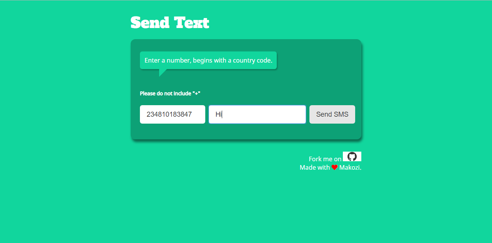

# Sending SMS from Web

A Web App that sends SMS messages using Node.js, Express, and Nexmo SMS API.



## Running This Demo Locally on Your Machine

### 1. Install dependencies

```bash
$ npm install
```

### 2. Set up a config.js with Your Credentials

Sign up at [Nexmo](https://nexmo.com) to get your own API keys and a virtual number.

Go to `config.js` in `/server`. The file should include the credentials. Input your  API Key, API Secret and Virtual Number

```javascript
module.exports = {
  api_key: 'API_KEY',
  api_secret: 'API_SECRET',
  number: 'NUMBER'
};
```

### 3. Run the Node App

```bash
$ node server/index.js
```

### 4. Launch it on Browser

Go to [http://localhost:4000](http://localhost:4000) and send text messages.

